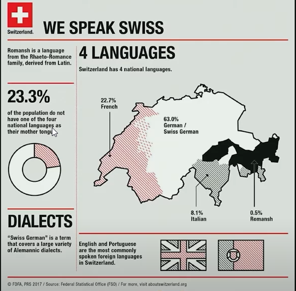
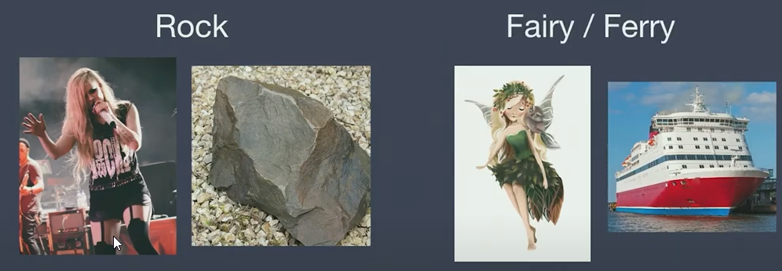
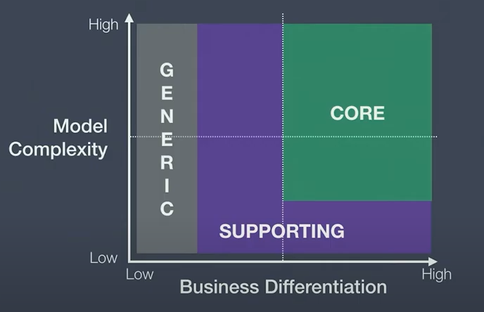
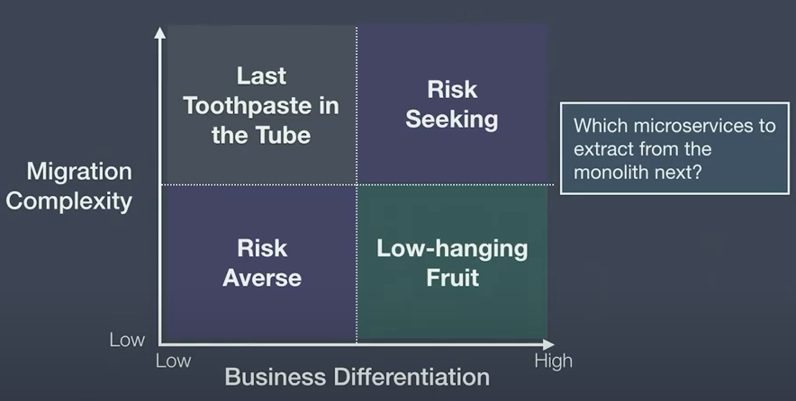

# Dissecting Bounded Contexts - Nick Tune - DDD Europe 2020

## Introduction
Breaking down larger things into smaller things.

* Books -> Chapters
* Days -> Hours 
* Systems -> Subsystems

### 5 virtues of modulatrity in systems
* Comprehensibility (Verstaendlichkeit) / cognitive load
* Parallel evolution / Team autonomy
* Fine-grained, ROI-aligned Investments
* Granular Customisability
* Containment (Eingrenzung, Beherrschung)

## Illusion of Boundaries

*A deeper understanding of the language gives us a better understanding of outside influences.*

### language is confusing
* JavaScript -> Not related to java
* Strawberries -> Contain no straw

### Homonyms, Homophones, Homographs

### Words do not convey full meaning

*The recipient must interpret the words and apply context*

You need the context of the word.

**To create and maintain good boundaries, DDD practitioners need to learn the domain model of language**

## Business model alignments

**A bounded context's purpose is to fulfil a role in an organisation's business model.**

If you don't understand the business model, you can't design the optimal bounded contexts.

### Monolith to Microservice

