# Dissecting Bounded Contexts - Nick Tune - DDD Europe 2020

## Introduction
Breaking down larger things into smaller things.

* Books -> Chapters
* Days -> Hours 
* Systems -> Subsystems

### 5 virtues of modulatrity in systems
* Comprehensibility (Verstaendlichkeit) / cognitive load
* Parallel evolution / Team autonomy
* Fine-grained, ROI-aligned Investments
* Granular Customisability
* Containment (Eingrenzung, Beherrschung)

## Illusion of Boundaries

*A deeper understanding of the language gives us a better understanding of outside influences.*

### language is confusing
* JavaScript -> Not related to java
* Strawberries -> Contain no straw

### Homonyms, Homophones, Homographs

### Words do not convey full meaning

*The recipient must interpret the words and apply context*

You need the context of the word.

**To create and maintain good boundaries, DDD practitioners need to learn the domain model of language**

## Business model alignments

**A bounded context's purpose is to fulfil a role in an organisation's business model.**

If you don't understand the business model, you can't design the optimal bounded contexts.

### Monolith to Microservice

### Core is not just money

Business model roles are good heuristics for deigning and evolving contexts.

* search engagement 
* advertising revenue
* gdpr compliance

See more on [wardley mapping](https://miro.com/blog/wardley-maps-whiteboard-canvas/).

# Sociotechnical context

"A loosely coupled software architecture and org structure to match" is a key predictor of:
1. continous delivery performance
2. Ability to scale org and increase performance linearly

extracted from [Accelerate: The Science Behind Devops: Building and Scaling High Performing Technology](https://www.amazon.de/Accelerate-Software-Performing-Technology-Organizations/dp/1942788339)

## Mental model

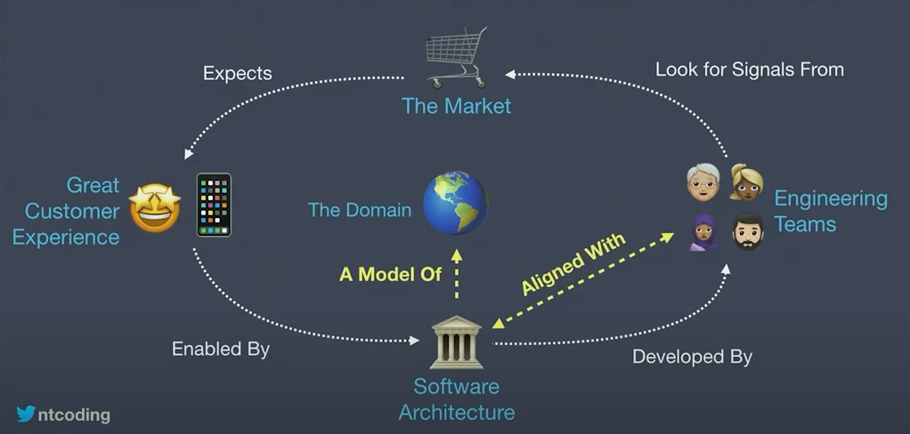

## Evolving
As the domain evolves, the sociotechnical architecture should evolve to maximise flow in core domains.

## Evolutionary patterns
* Collaborating -> XaaS
* Collaborating -> XaaS -> Facilitating
* Facilitating -> No Interaction
* XaaS -> Collaborating

## How to group teams
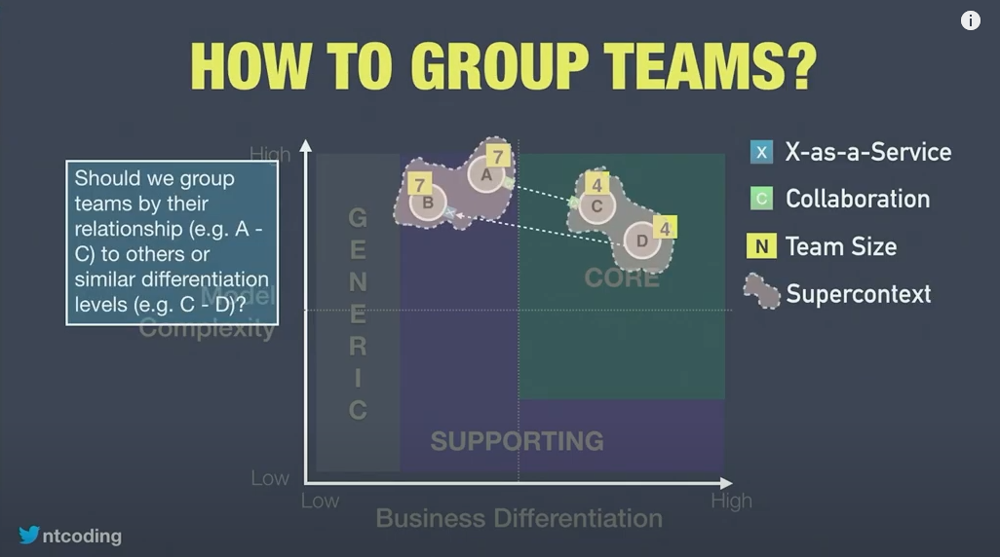

## Coupling
Domain coupling is fluid. Coupling is based on whats changing in business. Not concepts in software. Social architecture is more fluid than technical architecture.

## How can we handle it
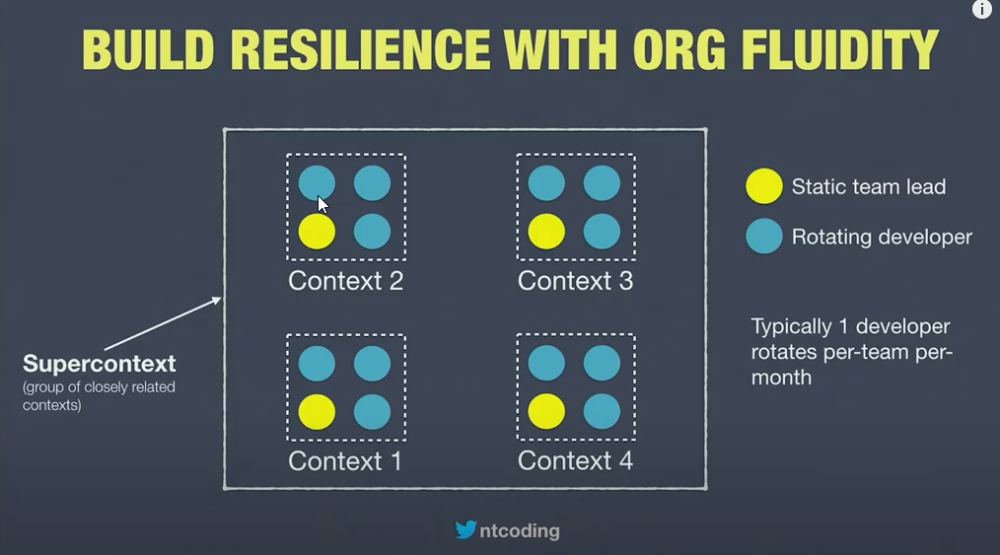

## How can we handle it
Don't do this always. Consider to think about it. 
Sometimes technology increases the problem. Are we exacerbating problems by working around organisational dysfunctions?

## Book references
* Team Topologies (Metthew Skelton, Manuel Pais)
* Dynamic Reteaming (Heide Hefand)
* DDD-Context Mapping

# Bounded context DNA

A lot of DDD experts rely on intuition to design bounded context. How can we teach and share that?

## DNA's breakthrough
* tracing ancestry
* causes of diseases
* genetic predisposition to dieses and other characteristics
* editing genes to cure diseases

## BC DNA
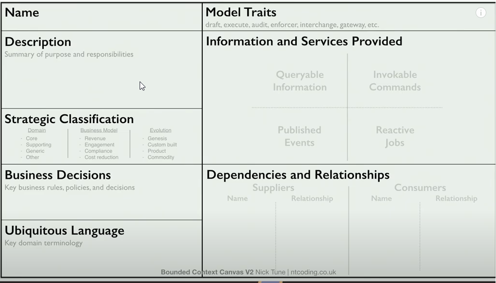

### BC roles and responsibilities

BC have specific roles and responsibilities.

## Octopus Enforcer Context
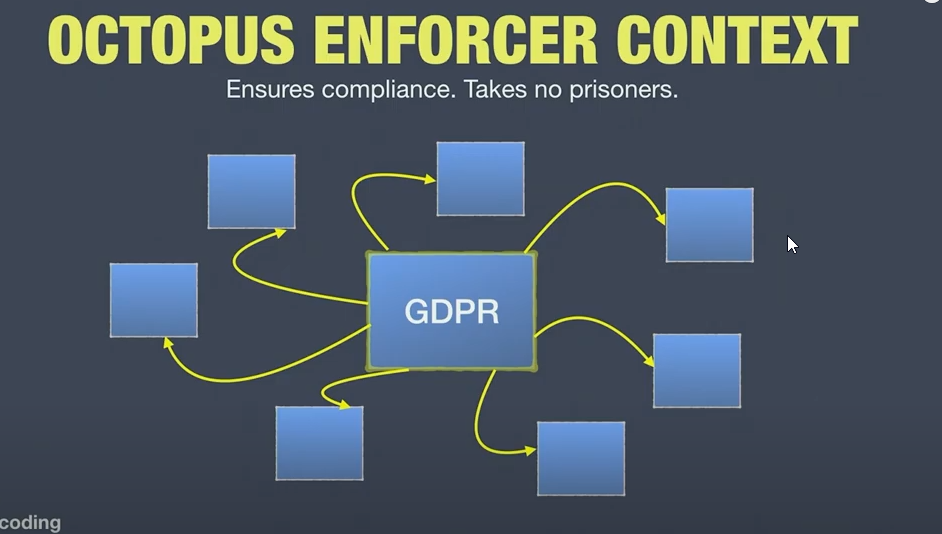

## Brain context
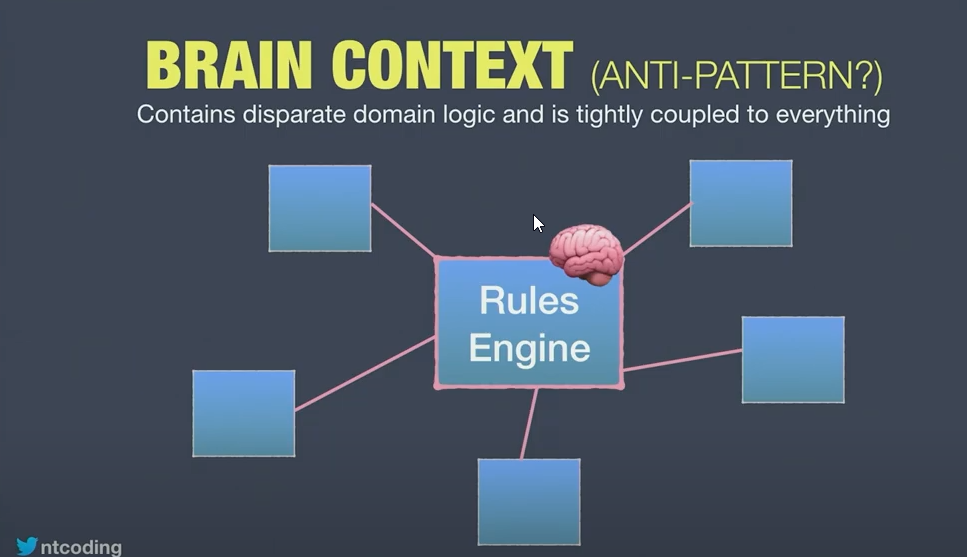

## Gateway interchange context
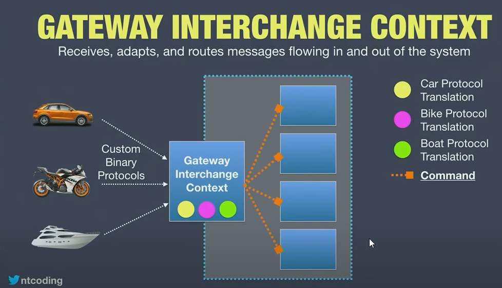

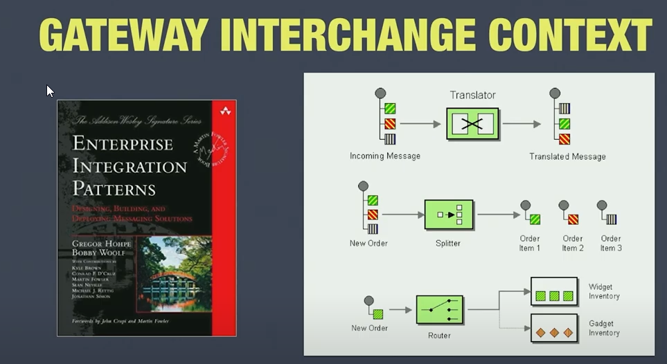

## Domain mapper context
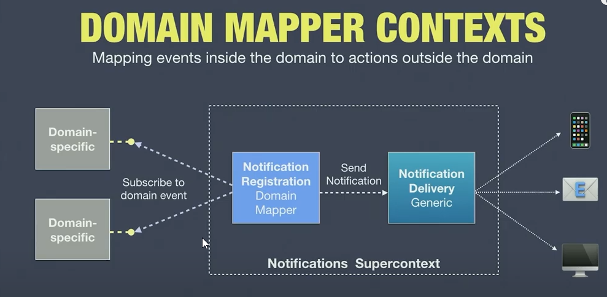

## Strategic patterns have sociotechnical implications

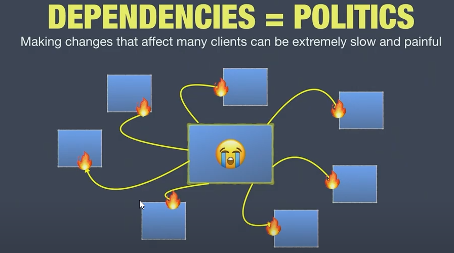

## Messaging patterns
[Mathias Verraes Patterns](https://verraes.net/)

## Dissecting BC
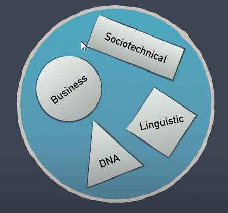

# Predictions and oppportunities

## Ubiquitous language 
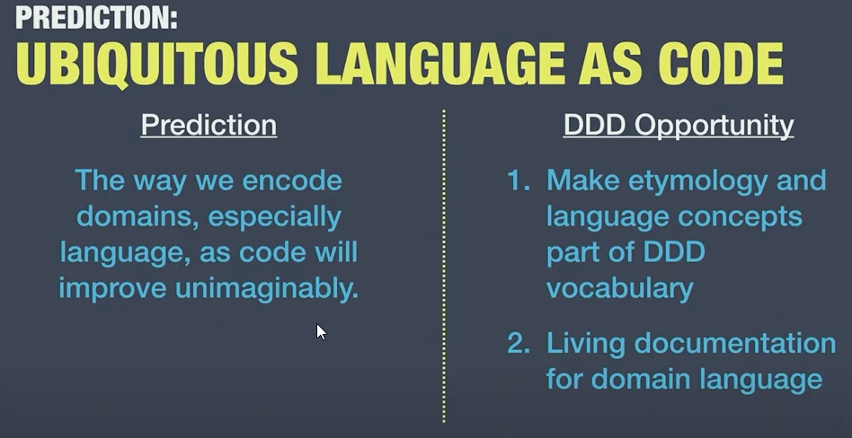
### Living Glossary
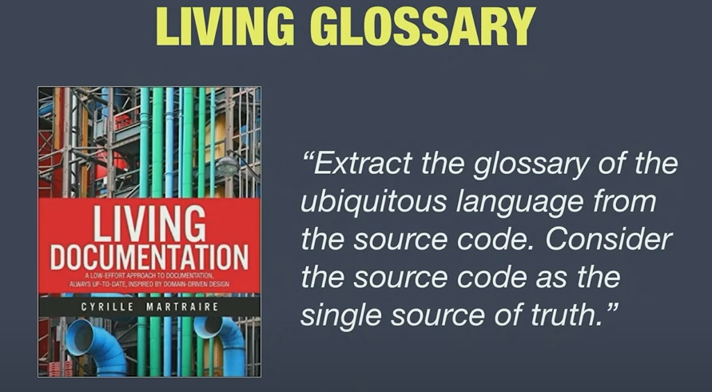

## BC DNA as metadata
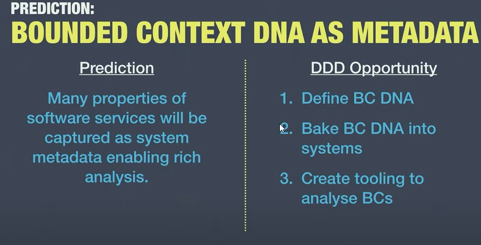

## Richer Process Patterns vocabulary
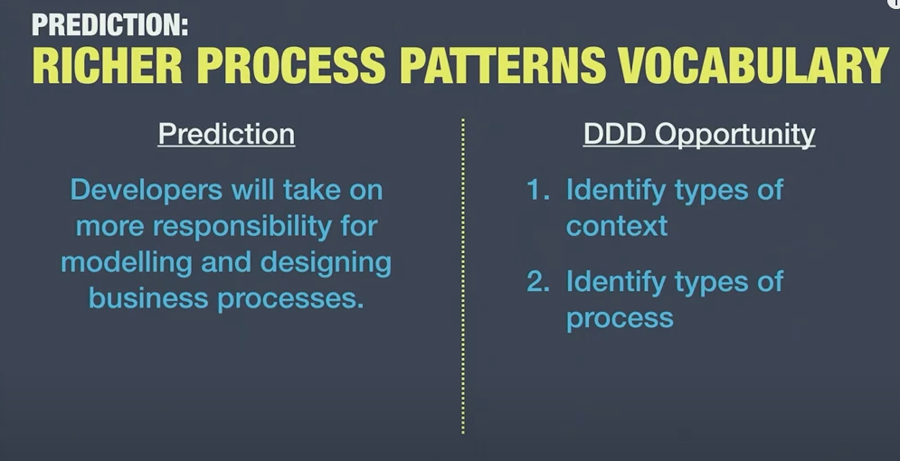

## Profitability metrics
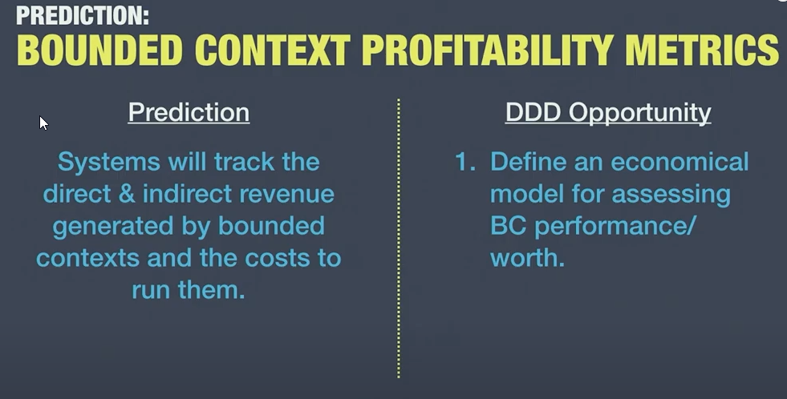

## Sociotechnical architecture
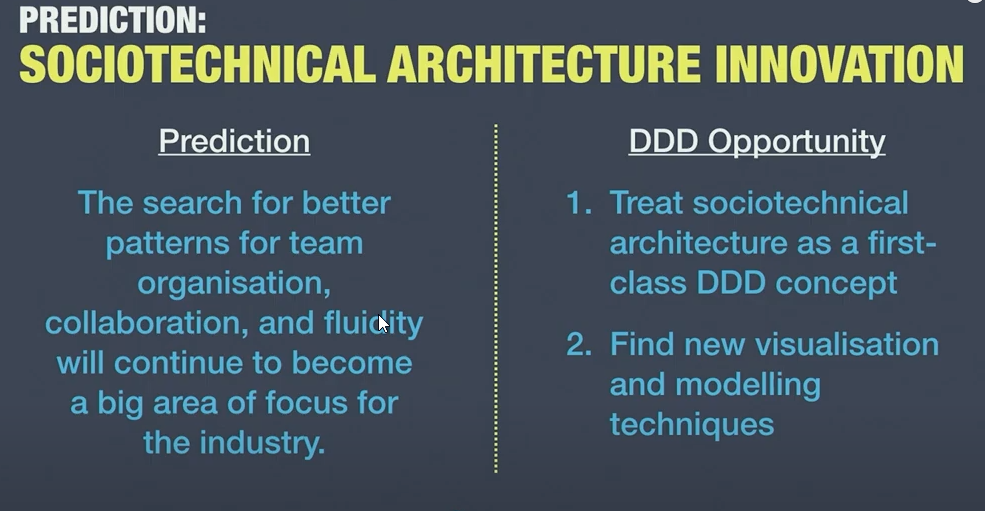

## Next 15 years
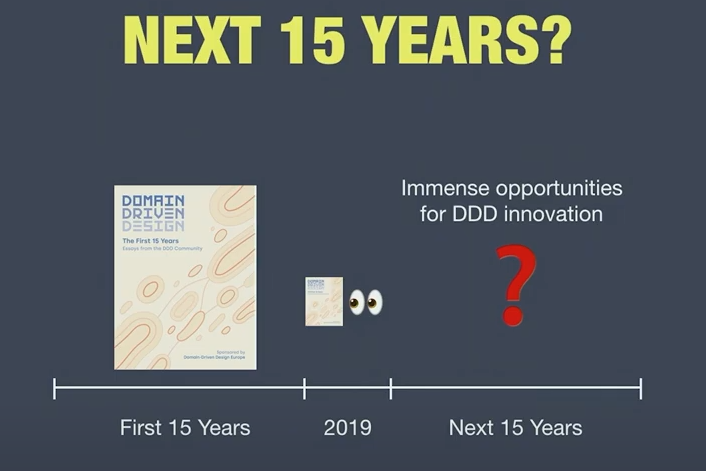